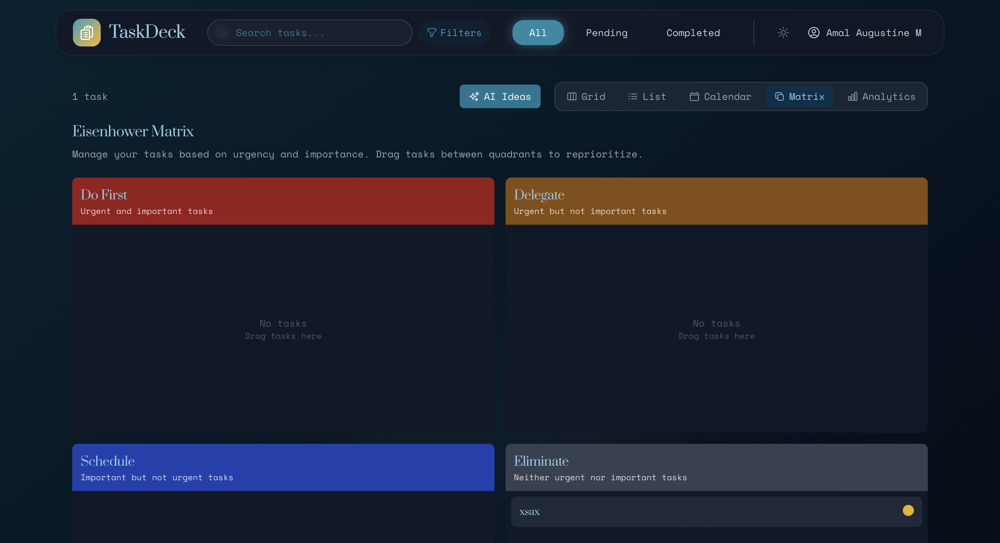

# Todo App with AI Suggestions

A modern, feature-rich Todo application built with React, TypeScript, Firebase, and Gemini AI.

## Screenshots

<details open>
<summary>Application Screenshots</summary>

### Home Page


### Calendar View


### Focus Timer


### Achievements System


### Login Screen


### Eisenhower Matrix


### Analytics Dashboard


### Add Task Modal


### Task List


</details>

## Features

- 📋 Task management with drag-and-drop functionality
- 🔄 Multiple view types (Grid, List, Calendar, Eisenhower Matrix)
- 📊 Productivity analytics dashboard
- 🛒 Task templates for quick task creation
- ⏱️ Focus mode timer with Pomodoro technique
- 👥 Task sharing capabilities
- 🌙 Dark/light mode support
- 🧠 AI-powered task suggestions with Google's Gemini API

## Getting Started

### Prerequisites

- Node.js (v16 or later)
- npm or yarn
- A Firebase project
- Google Gemini API key

### Installation

1. Clone the repository:
   ```bash
   git clone <repository-url>
   cd todo-app
   ```

2. Install dependencies:
   ```bash
   npm install
   ```

3. Create a `.env` file based on `.env.example` and fill in your Firebase and API keys.

4. Start the development server:
   ```bash
   npm run dev
   ```

## Setting up AI Suggestions with Gemini

This app uses Google's Gemini API to provide AI-powered task suggestions. To set it up:

1. Visit [Google AI Studio](https://makersuite.google.com/app/apikey) to get your Gemini API key.
2. Add the key to your `.env` file:
   ```
   VITE_GEMINI_API_KEY=your_gemini_api_key_here
   ```
3. Restart your development server if it's already running.

## Using AI Suggestions

1. Click the "AI Ideas" button in the task list header or use the sparkles icon in the Add Task modal.
2. Enter a prompt describing what kind of task suggestions you need.
3. Select from the generated suggestions to automatically fill in task details.

## Building for Production

To create a production build:

```bash
npm run build
```

## Technologies Used

- React
- TypeScript
- Vite
- Firebase (Authentication, Firestore)
- Framer Motion
- Tailwind CSS
- Google Gemini API
- React Router
- Redux Toolkit

## License

This project is licensed under the MIT License - see the LICENSE file for details.
